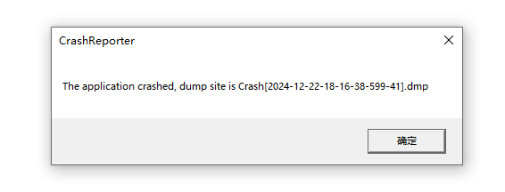

- v0.1.0.0
      - 更新内容：新增CrashReporter
      - 效果：
      - 耗时：
      - 精度：
      - 内存：

- example
```cpp
#include <iostream>

#include <CrashReporter.h>

#pragma comment(lib, "Debug/CrashReporter.lib")

int main(int, char **)
{
    CrashReporter::RegUnhandleException();
    int *p = nullptr;
    *p = 0;

    std::cout << "Hello, from test!\n";
}

```